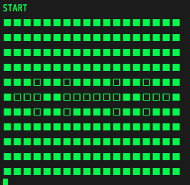
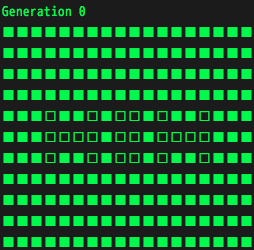
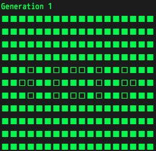

LifeGame
==================

>"Conway game",
>which redirects to here,
>can also refer to games as defined by surreal numbers,
>which John Conway also developed.

<http://ja.wikipedia.org/wiki/ライフゲーム>

<http://en.wikipedia.org/wiki/Conway's_Game_of_Life>

## Rules

1. [UnderPopulation]
    Any live cell with fewer than two live neighbours dies,  as if caused by under-population.
2. [Lives]
    Any live cell with two or three live neighbours lives on to the next generation.
3. [Overcrowding]
    Any live cell with more than three live neighbours dies,  as if by overcrowding.
4. [Birth]
    Any dead cell with exactly three live neighbours becomes a live cell,  as if by reproduction.

## start simulation
In the "objects" file,  there are some interesting pattern of lifegame.

1. blinker
2. glider
3. galaxy
4. pulsar
5. glider_gun
6. pentadecathion
7. diehard
8. acorn

## Screenshot

## Meta
